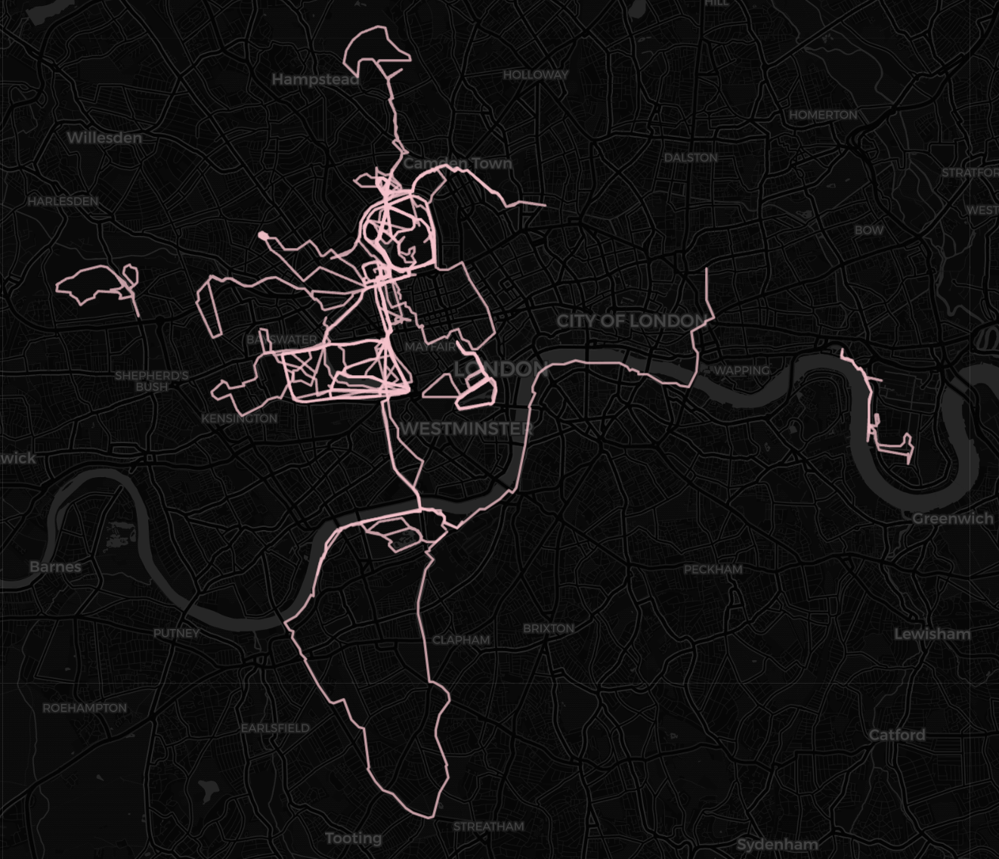

# London-Parks-Run-YAY
[Click here](https://nbviewer.org/github/hmcooper1/London-Parks-Run-YAY/blob/main/london_parks_run_yay.ipynb?flush_cache=true) to view the full notebook - Folium maps do not display on GitHub

## Overview
I loooove that London has so many parks and greenspaces and I am determined to run in as many of them as possible! I created two maps for this project - the first tracks which parks in zone 1 and 2 I have run in and which I haven't, and the second shows a heatmap of all my routes. I am starting with attempting to run at 50 parks :-)

## Data
- **Greenspace Information for Greater London (GiGL)**:
  - Defines park boundaries, which I use for shading in green/bluespaces on the map as well as checking whether a run intersects with a known park
- **Strava API**:
  - Pulls all my activity data, including GPS routes, allowing me to decode the route polylines and match them to park names
  - Use the date and description data from each activity to add personalised popups to each completed park marker

## Park Tracker Preview
All greenspaces across London are shaded, with markers highlighting parks located in Zones 1 and 2. A tree icon indicates parks where I’ve run, while a leaf icon marks parks I haven't run. Popups include the run description and date, with Holland Park selected as an example in the image below. The map automatically updates with new runs and routes each time I re-run the notebook!

## Heatmap Preview
A heatmap overlay of all my routes to display where I have run across London! (Yes I know I need to branch out more hopefully this project will help :0)

